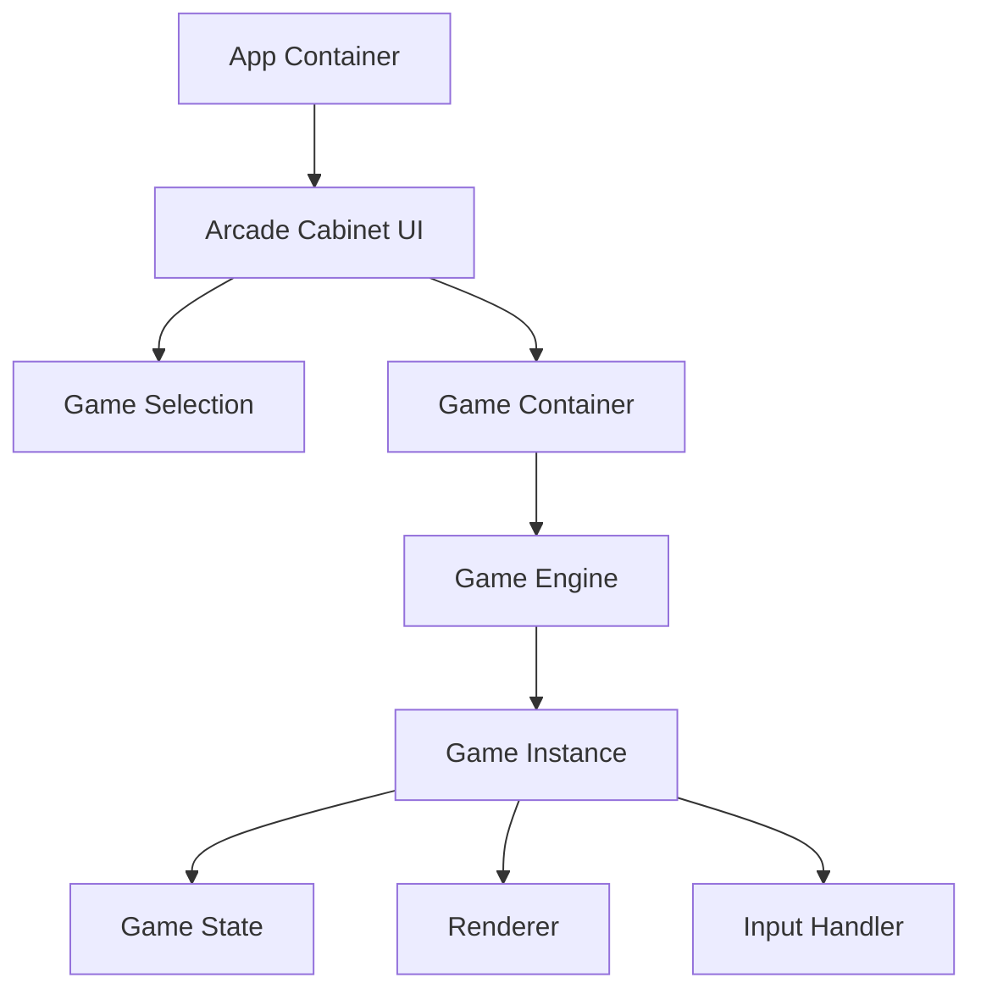
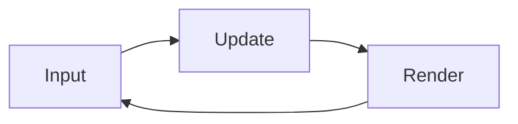
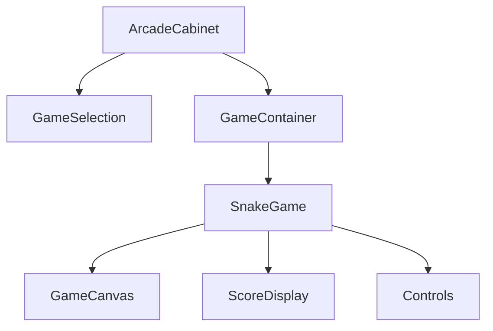

# System Patterns

## Architecture Overview

## Core Components

### Arcade Cabinet
- Retro-styled container for all games
- Handles game selection and transitions
- Manages global arcade state

### Game Engine
- Base class for all games
- Manages game loop
- Handles input processing
- Controls rendering pipeline

### Snake Game Implementation
- Extends base game engine
- Custom stink trail mechanics
- Skunk-themed graphics
- Score tracking

## Design Patterns

### Game Loop Pattern

### Component Hierarchy

### State Management
- Game state isolated per game
- Shared arcade state for global features
- Score persistence

## Asset Management
- Centralized asset loading
- Pixel art sprite system
- Audio management
- Texture atlases

## Responsive Design
- Arcade cabinet scales with viewport
- Game canvas maintains aspect ratio
- Touch controls for mobile
- Keyboard controls for desktop 